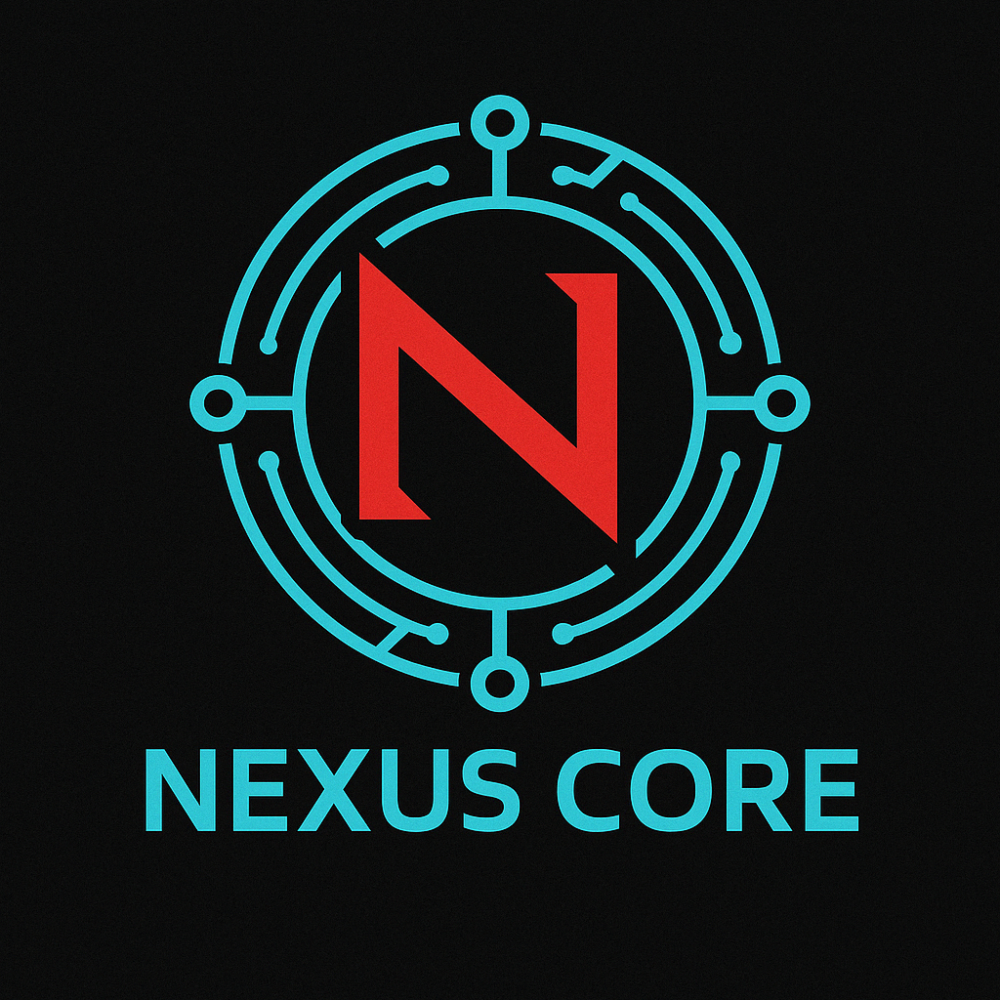

# Cyber Kingdom - Nexus Core (NXCR)



> "Onde Código e Soberania se Fundem"

## 📜 Sobre o Projeto

Cyber Kingdom é um ecossistema Web3 descentralizado, concebido para a era da incerteza quântica. O projeto combina blockchain, inteligência artificial e segurança avançada para oferecer serviços interconectados que recompensam a participação e incentivam a inovação.

No coração deste universo digital encontra-se o **Nexus Core (NXCR)** — um token utilitário e de governança ERC-20 que alimenta todo o ecossistema.

## 🚀 Funcionalidades Principais

- **Stellarcrucible Lock**: Sistema de staking com períodos de 3, 6 e 12 ciclos
- **Singularity Furnace**: Mecanismo de queima deflacionária automática e manual
- **Chrono-Contribution Ledger**: Sistema de recompensa por contribuição (Proof-of-Contribution)
- **Prime Directive Council**: Governança descentralizada baseada em votação
- **Foundation Vault**: Reserva estratégica para financiar o desenvolvimento
- **Quantum Liquidity Vein**: Mecanismo para garantir liquidez inicial e contínua

## 🛠️ Tecnologias

- Solidity ^0.8.19
- Hardhat
- OpenZeppelin Contracts
- Ethers.js

## 📋 Pré-requisitos

- Node.js (v16+)
- npm ou yarn
- Git

## 🔧 Instalação e Configuração

1. Clone o repositório
```bash
git clone https://github.com/your-username/cyber-kingdom-token.git
cd cyber-kingdom-token
```

2. Instale as dependências
```bash
npm install
```

3. Configure seu arquivo .env (veja .env.example)
```bash
cp .env.example .env
# Edite o arquivo .env com suas chaves privadas e URLs de API
```

4. Compile os contratos
```bash
npx hardhat compile
```

## 🧪 Testes

### Executando testes unitários

```bash
npx hardhat test
```

### Executando testes com cobertura

```bash
npx hardhat coverage
```

### Testes específicos

```bash
npx hardhat test test/NexusCore.test.js
```

### Casos de Teste Principais

1. **Staking Tests**:
   - Verificação do APY correto para períodos de 3, 6 e 12 ciclos
   - Teste da penalidade por resgates antecipados (15%)

2. **Burn Mechanism Tests**:
   - Verificação da queima automática de 5% em transferências
   - Teste da função de queima manual

3. **Chrono-Contribution Tests**:
   - Teste das limitações semanais de unidades (5.000 por endereço)
   - Verificação da conversão correta (1.000 unidades = 1 NXCR)

4. **Governance Tests**:
   - Verificação do limite mínimo para proposição de leis (25.000 NXCR)
   - Teste do cálculo de votos (1 NXCR = 1 voto)

## 📜 Scripts

```bash
# Compilar contratos
npx hardhat compile

# Executar testes
npx hardhat test

# Executar análise de cobertura de código
npx hardhat coverage

# Iniciar nó local de desenvolvimento
npx hardhat node

# Implantar em rede local (desenvolvimento)
npx hardhat run --network localhost scripts/deploy.js

# Implantar em testnet (Goerli)
npx hardhat run --network goerli scripts/deploy.js

# Verificar contrato no Etherscan
npx hardhat verify --network goerli CONTRACT_ADDRESS CONSTRUCTOR_ARG1 CONSTRUCTOR_ARG2
```

## 🚀 Deployment

O contrato Nexus Core é implantado com os seguintes parâmetros iniciais:

- **Foundation Vault**: Multisig (3/5) controlando a reserva estratégica
- **APY de Staking**: 15% para ciclos de 12 meses
- **Taxa de Queima**: 5% por transferência
- **Quantum Oracle**: Endereço do oráculo responsável pelas contribuições

### Exemplo de deployment na Mainnet:

```javascript
// Script exemplo para deploy na Ethereum Mainnet
async function main() {
  const [deployer] = await ethers.getSigners();
  const NXCR = await ethers.getContractFactory("NexusCore");
  const nxcr = await NXCR.deploy(
    "0x...",  // Endereço da Foundation Vault (multisig)
    "0x...",  // Endereço do Quantum Oracle
    15,       // stellarcrucibleAPY (15%)
    5         // singularityBurnRate (5%)
  );
  await nxcr.deployed();
  console.log("Nexus Core deployed to:", nxcr.address);
}
```

## 📊 Tokenomics

**Supply Total**: 1.000.000.000 NXCR

| Categoria                  | Quantidade  | %    | Modelo de Vesting                        |
|----------------------------|-------------|------|------------------------------------------|
| Comunidade e Recompensas   | 400.000.000 | 40%  | Liberação trimestral (5 anos)            |
| Equipe & Desenvolvedores   | 200.000.000 | 20%  | 1 ano de cliff; 25% ao ano               |
| Parceiros e Investidores   | 150.000.000 | 15%  | 20% no TGE; 80% em 18 meses              |
| Ecosystem Fund             | 150.000.000 | 15%  | Gerido via DAO                           |
| Liquidez Inicial           | 100.000.000 | 10%  | 100% liberados no TGE                    |

## ⚖️ Licença

Este projeto está licenciado sob a Licença MIT - veja o arquivo [LICENSE](LICENSE) para mais detalhes.

## 🔗 Links Úteis

- [Whitepaper](./whitepaper.md)
- [Website]
- [Twitter]
- [Documentação]

## 👥 Equipe

- **King Moriarty**